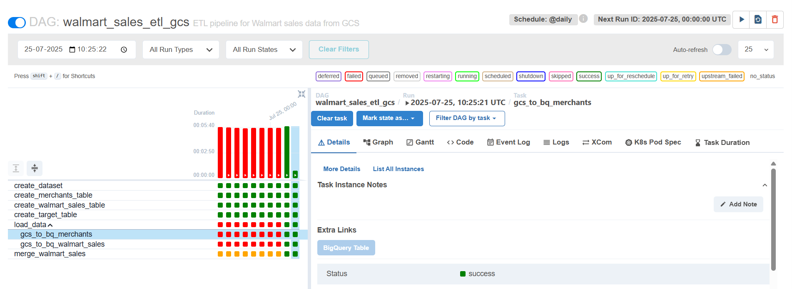

# 🛒 Walmart Sales ETL Pipeline using Apache Airflow & BigQuery

## 📌 Project Overview

This project showcases a real-world **ETL (Extract, Transform, Load)** pipeline for processing **Walmart sales data** using **Google Cloud Platform (GCP)** services and **Apache Airflow** as the orchestration engine. 

The goal is to automate the data ingestion process from **Google Cloud Storage (GCS)** to **BigQuery**, transform it by joining with dimension tables, and upsert it into a well-structured target table to support analytics and reporting use cases.

---

## 🚀 Objective

The primary goals of this project are:

- **Automated Data Ingestion:** Load raw JSON files from a GCS bucket into BigQuery.
- **Table Management:** Dynamically create required BigQuery tables for staging, dimension, and target data.
- **Data Transformation:** Perform a left join between staging sales data and merchant dimension table.
- **Fact Table Maintenance:** Use `MERGE` query to upsert data into the target fact table to prevent duplication and maintain consistency.
- **Workflow Orchestration:** Use Airflow to manage and schedule these tasks as part of a repeatable pipeline.

---

## 🛠️ Tech Stack

| Technology        | Description |
|-------------------|-------------|
| **Python**        | Used to write DAGs and configure operators in Airflow |
| **Apache Airflow**| Used to orchestrate and schedule data workflows |
| **Google Cloud Storage (GCS)** | Acts as the raw data source (input layer) |
| **BigQuery**      | Cloud Data Warehouse used to store and query structured data |
| **BigQuery Operators** | Provided by Airflow to interact with BigQuery |
| **GCSToBigQueryOperator** | Specialized operator to load GCS data directly into BigQuery |

---

## 📂 Project Structure

```
walmart_sales_etl/
│
├── dags/
│   └── walmart_sales_etl_dag.py         # Airflow DAG definition
├── data/
│   ├── walmart-sales/                   # Contains raw sales JSON files
│   └── walmart-merchant/                # Contains raw merchant JSON files
├── README.md                            # Project documentation
```

---

## 📦 GCS Bucket Layout

The data is stored in two folders in a Google Cloud Storage bucket:

- `walmart-sales/` – Contains transactional sales data as JSON files.
- `walmart-merchant/` – Contains merchant metadata (merchant_id, name, etc.) as JSON files.

Example paths:

```
gs://walmart-ingestions/walmart-sales/*.json
gs://walmart-ingestions/walmart-merchant/*.json
```

---

## 🧱 BigQuery Dataset & Tables

- **Dataset**: `walmart_dwh`

- **Tables**:
  - `merchants_tb` – Merchant dimension table.
  - `walmart_sales_stage` – Raw sales data staging table.
  - `walmart_sales_tgt` – Final fact table used for analytics and reporting.

Each table is defined with appropriate schema fields, data types, and update strategies.

---

## 🪜 Airflow DAG Workflow

1. **Create Dataset**
   - A BigQuery dataset named `walmart_dwh` is created if it doesn't exist.

2. **Create Tables**
   - Three tables are created in BigQuery using `BigQueryCreateEmptyTableOperator`.

3. **Load Data from GCS**
   - Load merchant and sales JSON data into respective staging tables using `GCSToBigQueryOperator`.

4. **Merge Stage to Target**
   - Execute a `MERGE` SQL query using `BigQueryInsertJobOperator` to upsert sales data into the final target table by joining with the merchant dimension table.

---

## 🔁 Schedule & Retry Configuration

- **Schedule**: Runs **daily** using `@daily` cron expression.
- **Retries**: 1 retry on failure.
- **Catchup**: Disabled (`catchup=False`) to prevent historical reprocessing unless required.




---

## ✅ Steps to Run the Pipeline

1. Make sure you have a **Google Cloud project** with **BigQuery** and **Cloud Storage** enabled.
2. Upload JSON data to the appropriate folders in your GCS bucket.
3. Set up and run **Apache Airflow** either locally or in **Cloud Composer**.
4. Place the DAG Python file in your Airflow `dags/` folder.
5. Trigger the DAG manually or wait for the scheduled run.

---

## 🔐 IAM Roles Required

To execute the DAG successfully, ensure your Airflow service account has the following IAM permissions:

- `roles/bigquery.admin`
- `roles/storage.objectViewer`
- `roles/storage.objectCreator`
- `roles/storage.admin` (recommended during development)

---

## 🧠 Example Merge Query Logic

```sql
MERGE `project.dataset.walmart_sales_tgt` T
USING (
    SELECT ...
    FROM `project.dataset.walmart_sales_stage` S
    LEFT JOIN `project.dataset.merchants_tb` M
    ON S.merchant_id = M.merchant_id
) S
ON T.sale_id = S.sale_id
WHEN MATCHED THEN
  UPDATE SET ...
WHEN NOT MATCHED THEN
  INSERT (...);
```

This ensures that records are either updated or inserted without duplication.

---
